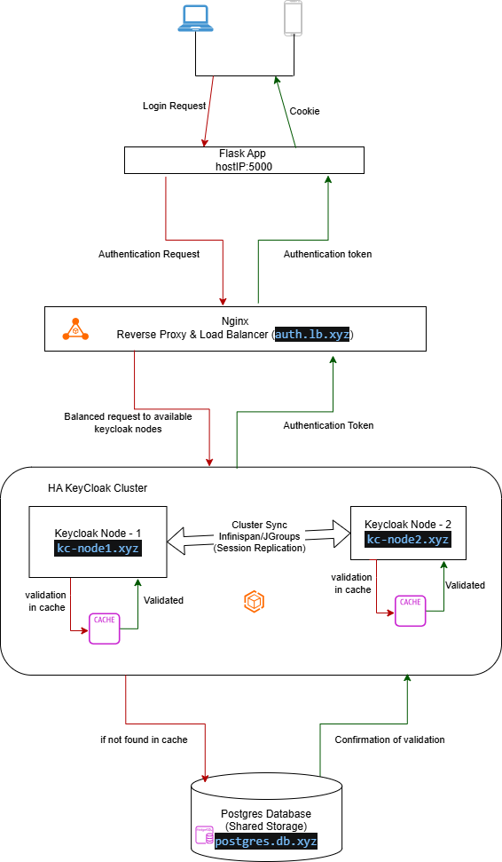
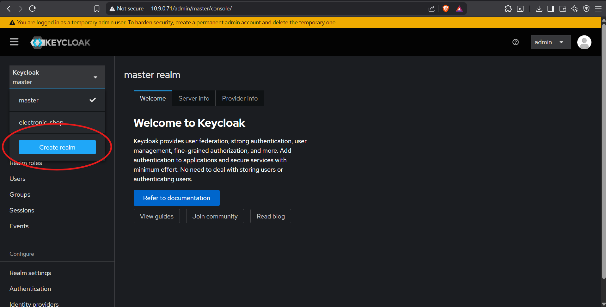
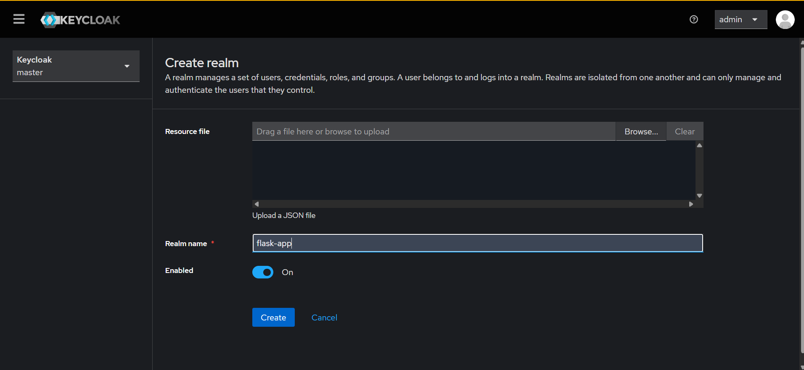
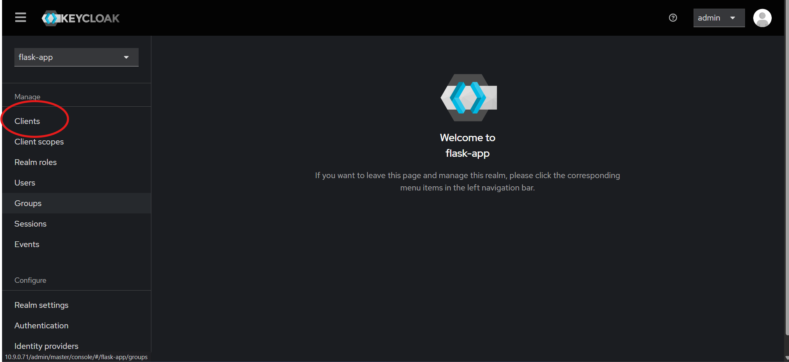
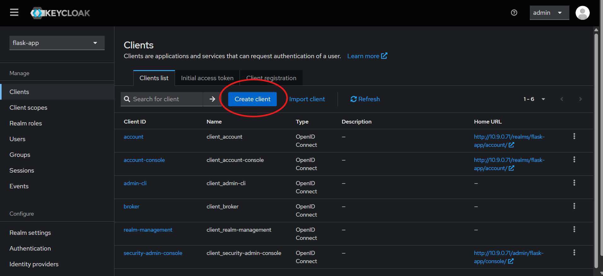
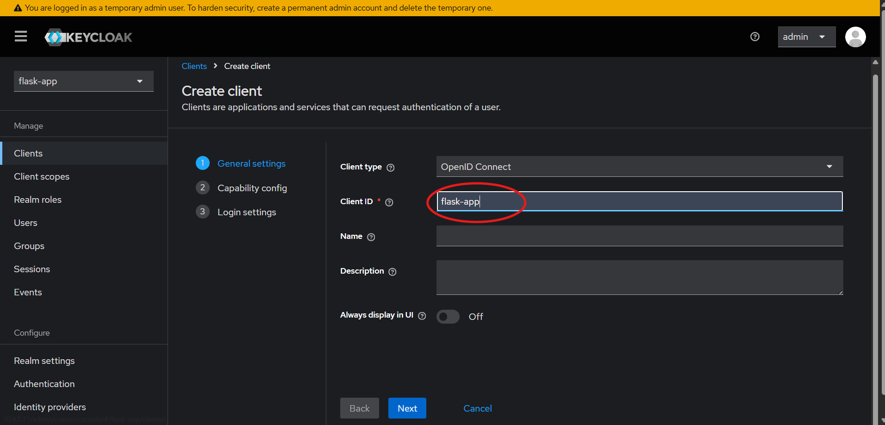
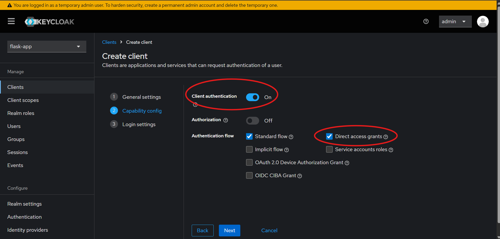
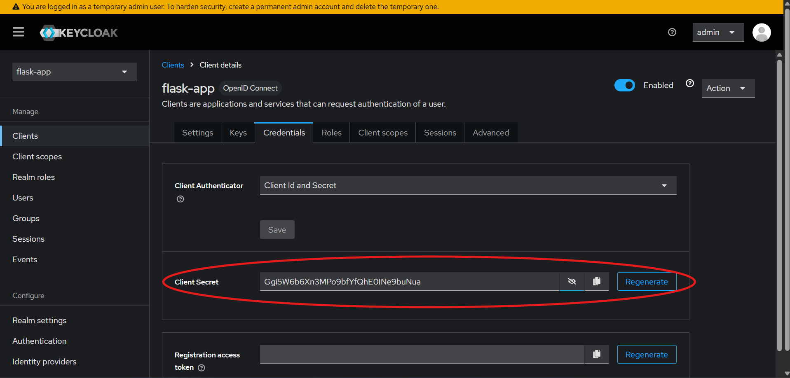

# 🔐 Keycloak HA Deployment Guide

A structured, multi-VM **Keycloak High Availability** deployment using **Keycloak**, **PostgreSQL**, **NGINX**, and a **Flask application**.

This repository supports **two Flask deployment choices** so users can pick what fits their environment best:

| Option | Description | Best For |
|---|---|---|
| 🧩 **Code Base** | Run the Flask app directly from the source code | Users who want more control and prefer running it as a service |
| 🐳 **Docker Compose** | Run the Flask app using Docker Compose | Users who prefer containerized deployment |

---

## 📚 Table of Contents

- [📌 Overview](#-overview)
- [🛡️ What is Keycloak?](#️-what-is-keycloak)
- [🤔 Why Do We Use Keycloak?](#-why-do-we-use-keycloak)
- [🧱 Existing Problem Statement](#-existing-problem-statement)
- [🧪 Build Challenge Faced During HA Setup](#-build-challenge-faced-during-ha-setup)
- [🎯 Why High Availability for Keycloak?](#-why-high-availability-for-keycloak)
- [⚠️ Current Limitation](#️-current-limitation)
- [🏗️ Architecture Overview](#️-architecture-overview)
- [🖼️ Architecture Diagram](#️-architecture-diagram)
- [📁 Repository Layout](#-repository-layout)
- [🛠️ Technology Stack](#️-technology-stack)
- [🔄 How the Cluster Works](#-how-the-cluster-works)
- [🌐 NGINX Note](#-nginx-note)
- [✅ Prerequisites](#-prerequisites)
- [🧭 /etc/hosts Configuration](#-etchosts-configuration)
- [🚀 Deployment Steps](#-deployment-steps)
  - [1️⃣ PostgreSQL VM](#1️⃣-postgresql-vm)
  - [2️⃣ Keycloak Node 1 VM](#2️⃣-keycloak-node-1-vm)
  - [3️⃣ Keycloak Node 2 VM](#3️⃣-keycloak-node-2-vm)
  - [4️⃣ NGINX VM](#4️⃣-nginx-vm)
  - [5️⃣ Flask Application Setup in Keycloak](#5️⃣-flask-application-setup-in-keycloak)
  - [6️⃣ Flask Application Deployment Options](#6️⃣-flask-application-deployment-options)
    - [Option A: 🧩 Code Base Deployment](#option-a--code-base-deployment)
    - [Option B: 🐳 Docker Compose Deployment](#option-b--docker-compose-deployment)
- [🧪 Verification](#-verification)
- [📌 Summary](#-summary)

---

## 📌 Overview

This repository provides a **high-availability Keycloak deployment** by running **two Keycloak nodes in a cluster** behind an **NGINX load balancer**, with **PostgreSQL** as the shared backend database.

### ✨ Core features

- ✅ 2 Keycloak nodes
- ✅ Shared PostgreSQL backend
- ✅ NGINX load balancing
- ✅ Cluster discovery using `jdbc-ping`
- ✅ Sticky sessions for better session continuity
- ✅ Flask app deployment using either:
  - 🧩 Code Base
  - 🐳 Docker Compose

---

## 🛡️ What is Keycloak?

**Keycloak** is an open-source **Identity and Access Management (IAM)** solution used to handle **authentication** and **authorization** for applications and services.

In simple terms, Keycloak helps applications:

- 👤 log users in
- 🔐 manage passwords and credentials
- 🎫 issue tokens for secure access
- 🏢 support centralized identity management
- 🔄 integrate with modern auth protocols such as OAuth2 and OpenID Connect

Instead of building login, session handling, token generation, and identity logic from scratch inside every application, Keycloak provides a centralized platform to manage those responsibilities.

---

## 🤔 Why Do We Use Keycloak?

We use Keycloak because it provides a secure and centralized way to manage authentication for applications like our Flask app.

### ✅ Benefits of using Keycloak

| Benefit | Why it matters |
|---|---|
| Centralized authentication | One place to manage login and access control |
| Token-based security | Better integration with modern web applications and APIs |
| Easier client management | Applications can be configured as clients instead of building auth logic manually |
| Scalable identity layer | Easier to expand across multiple applications and environments |
| Standards-based | Supports OAuth2, OpenID Connect, and enterprise-style identity flows |

For this project, Keycloak acts as the **authentication layer** between the Flask application and the user login flow.

---

## 🧱 Existing Problem Statement

Before building this repository, the environment was using a **single Keycloak instance**.

### ⚠️ Why that was a problem

A single Keycloak instance is **not fault tolerant**. That means if the only Keycloak node goes down because of:

- service failure
- host failure
- reboot
- maintenance
- network issue

then the whole authentication flow becomes unavailable.

### 💡 Why this repository was built

Because of that limitation, this repository was built to create a **more highly available Keycloak architecture** by introducing:

- ✅ two Keycloak nodes
- ✅ shared PostgreSQL persistence
- ✅ NGINX load balancing
- ✅ clustered session/cache behavior

So this project is not just a deployment example — it is the result of solving a real fault-tolerance gap in the earlier single-node design.

---

## 🧪 Build Challenge Faced During HA Setup

While building this solution, one major challenge appeared during cluster formation.

### What worked easily

When the Keycloak containers were deployed on a **single machine**, the cluster could form more easily because the containers were able to discover and communicate with each other without much difficulty.

### What failed across separate VMs

When the Keycloak nodes were deployed on **separate virtual machines**, the containers could not discover each other properly. As a result:

- the cluster did not form correctly
- the nodes could not consistently see each other
- distributed behavior across the VMs was unreliable

### ✅ How the issue was solved

To solve this, the deployment had to explicitly use **JGroups bind address configuration**, so each Keycloak node would bind cluster communication to the **real VM IP address** rather than depending only on container-level defaults.

This is why `JAVA_OPTS_APPEND` is important in this project — it ensures JGroups traffic is bound correctly for cross-VM cluster communication.

### Why this matters

This was a key implementation detail that made the difference between:

| Scenario | Outcome |
|---|---|
| Containers on one machine | Cluster forms more easily |
| Containers on separate VMs without proper bind address | Cluster discovery fails |
| Containers on separate VMs with JGroups bind address | Cluster communication works correctly |

---

## 🎯 Why High Availability for Keycloak?

In a single-node Keycloak setup, the authentication tier is **not fault tolerant**.

If that one Keycloak instance goes down because of:

- service crash
- VM failure
- maintenance
- network issue

then authentication stops working.

This repository improves that design by introducing:

| Improvement | Benefit |
|---|---|
| 2 Keycloak nodes | Reduces single-node failure risk |
| Shared PostgreSQL | Central persistence for both nodes |
| `jdbc-ping` discovery | Allows nodes to find each other through the database |
| NGINX load balancer | Distributes authentication traffic |

According to Keycloak’s clustering approach, production deployments can use **distributed caching** and **`jdbc-ping`** for node discovery, which makes this a practical multi-node design.

---

## ⚠️ Current Limitation

> This repository improves **Keycloak-tier availability only**. It is **not yet fully end-to-end fault tolerant**.

### 🚧 Current single points of failure

| Component | Current State |
|---|---|
| NGINX VM | Single instance |
| PostgreSQL VM | Single instance |

### What this means

- ✅ Keycloak layer is redundant
- ❌ NGINX is still a single point of failure
- ❌ PostgreSQL is still a single point of failure

---

## 🏗️ Architecture Overview

This deployment uses a **4-VM architecture**.

| VM | Role | Hostname |
|---|---|---|
| VM1 | NGINX Load Balancer | `auth.lb.xyz` |
| VM2 | Keycloak Node 1 | `kc-node1.xyz` |
| VM3 | Keycloak Node 2 | `kc-node2.xyz` |
| VM4 | PostgreSQL | `postgres.db.xyz` |
| VM5 | Flask App | `10.9.0.70:5000` |

### 🔁 Request Flow

```text
User → Flask App → NGINX Load Balancer → Keycloak Cluster → PostgreSQL
```

---

## 🖼️ Architecture Diagram



### How it works

- Flask sends authentication requests to NGINX
- NGINX forwards requests to one of the two Keycloak nodes
- Keycloak nodes synchronize through Infinispan/JGroups
- Both Keycloak nodes use the same PostgreSQL database

---

## 📁 Repository Layout

Below is the current repository structure:

```text
KeyCloak-HA/
├── flask-app/
│   ├── Code-Base/
│   │   ├── static/
│   │   ├── templates/
│   │   ├── venv/
│   │   ├── .dockerignore
│   │   ├── .env
│   │   ├── .env.example
│   │   ├── app.py
│   │   ├── Dockerfile
│   │   └── requirements.txt
│   └── Docker-Compose/
│       ├── .env
│       └── docker-compose.yml
├── keycloak-node1/
│   ├── .env
│   └── docker-compose.yml
├── keycloak-node2/
│   ├── .env
│   └── docker-compose.yml
├── nginx/
│   ├── .env
│   ├── default.conf.template
│   └── docker-compose.yml
├── postgres/
│   ├── .env
│   └── docker-compose.yml
├── .gitignore
├── diagram.png
├── flask-keycloak-setup.md
├── README.md
└── README.original.md
```

### 📌 Notes on Flask structure

| Path | Purpose |
|---|---|
| `flask-app/Code-Base/` | Source-code-based Flask deployment |
| `flask-app/Docker-Compose/` | Docker Compose deployment for Flask |
| `flask-app/Code-Base/app.py` | Main Flask application |
| `flask-app/Code-Base/requirements.txt` | Python dependencies |
| `flask-app/Code-Base/.env.example` | Example environment file |

---

## 🛠️ Technology Stack

| Component | Version / Purpose |
|---|---|
| Keycloak | `26.1.0` |
| PostgreSQL | `16` |
| Docker Engine | Container runtime |
| Docker Compose v2 | Multi-container orchestration |
| NGINX | Reverse proxy and load balancer |
| Infinispan + JGroups | Cluster communication |
| `jdbc-ping` | Keycloak node discovery |
| `systemd` | Run Flask code base in background as a service |

---

## 🔄 How the Cluster Works

Each Keycloak node runs independently on its own VM, but both nodes:

- connect to the same PostgreSQL database
- use distributed caching
- participate in the same Keycloak cluster

### Important environment behavior

| Variable | Purpose |
|---|---|
| `KC_CACHE=ispn` | Enables Infinispan |
| `KC_CACHE_STACK=jdbc-ping` | Enables DB-based node discovery |
| `JAVA_OPTS_APPEND` | Binds JGroups traffic to the real VM IP |

### Load balancing behavior

NGINX sits in front of both Keycloak nodes and forwards authentication traffic using **sticky sessions**, helping keep a user bound to the same backend node when possible.

---

## 🌐 NGINX Note

The original design uses **native NGINX** on the VM.

This repository uses **Docker Compose** for NGINX instead, while keeping the same behavior.

### NGINX responsibilities

- listens on port `80`
- forwards traffic to:
  - `10.9.0.72:8080`
  - `10.9.0.73:8080`
- passes `X-Forwarded-*` headers
- supports sticky sessions based on `AUTH_SESSION_ID`

---

## ✅ Prerequisites

Prepare the Ubuntu VMs with:

- Ubuntu `20.04` or `22.04`
- Docker Engine
- Docker Compose v2

### Install base packages

```bash
sudo apt update
```

```bash
sudo apt install -y docker.io docker-compose-v2
```

```bash
sudo systemctl enable --now docker
```

---

## 🧭 `/etc/hosts` Configuration

Modify the `/etc/hosts` file on **every VM** as well as on the **machine** you will use to access the Keycloak dashboard, and include the following entries:

```text
10.9.0.74  postgres.db.xyz
10.9.0.71  auth.lb.xyz
10.9.0.72  kc-node1.xyz
10.9.0.73  kc-node2.xyz
```

---

## 🚀 Deployment Steps

Clone the same repository on every VM, but run only the relevant directory for that VM.

---

## 1️⃣ PostgreSQL VM

| Item | Value |
|---|---|
| VM IP | `10.9.0.74` |
| Hostname | `postgres.db.xyz` |
| Directory | `postgres/` |

```bash
git clone https://github.com/Rafi-Siddiki/KeyCloak-HA.git
```

```bash
cd KeyCloak-HA/postgres
```

```bash
docker compose up -d
```

---

## 2️⃣ Keycloak Node 1 VM

| Item | Value |
|---|---|
| VM IP | `10.9.0.72` |
| Hostname | `kc-node1.xyz` |
| Directory | `keycloak-node1/` |

```bash
git clone https://github.com/Rafi-Siddiki/KeyCloak-HA.git
```

```bash
cd KeyCloak-HA/keycloak-node1
```

```bash
docker compose up -d
```

---

## 3️⃣ Keycloak Node 2 VM

| Item | Value |
|---|---|
| VM IP | `10.9.0.73` |
| Hostname | `kc-node2.xyz` |
| Directory | `keycloak-node2/` |

```bash
git clone https://github.com/Rafi-Siddiki/KeyCloak-HA.git
```

```bash
cd KeyCloak-HA/keycloak-node2
```

```bash
docker compose up -d
```

---

## 4️⃣ NGINX VM

| Item | Value |
|---|---|
| VM IP | `10.9.0.71` |
| Hostname | `auth.lb.xyz` |
| Directory | `nginx/` |

```bash
git clone https://github.com/Rafi-Siddiki/KeyCloak-HA.git
```

```bash
cd KeyCloak-HA/nginx
```

```bash
docker compose up -d
```

---

## 5️⃣ Flask Application Setup in Keycloak

Before running the Flask app, you must create the `Keycloak realm` and `client`.

Navigate to `http://10.9.0.71` and log in with the bootstrap values from the **Keycloak node env** file for this repo:

```bash
user = kcadmin_demo
```

```bash
password = DemoAdminPass_2026!
```

### Phase 1: Create Realm

1. Open the **Keycloak Admin Console**
2. Hover over the realm selector
3. Click **Create Realm**
4. Set the realm name to:

```text
electronic-shop
```





---

### Phase 2: Create Client

1. Open **Clients**
2. Click **Create client**
3. Set the **Client ID** to:

```text
flask-app
```

4. Click **Next**

#### 🖼️ Screenshots







---

### Phase 3: Configure Client Capabilities

In the client configuration:

| Setting | Value |
|---|---|
| Client authentication | `On` |
| Direct access grants | Enabled |

Then click **Save**.

#### 🖼️ Screenshots



---

### Phase 4: Retrieve Client Secret

1. Open the **Credentials** tab
2. Copy the **Client secret**

#### 🖼️ Screenshots



---

## 6️⃣ Flask Application Deployment Options in VM

You can deploy the Flask app in **two different ways**.

| Option | Path | Recommended For |
|---|---|---|
| 🧩 Code Base | `flask-app/Code-Base/` | Users who want to run the app as a service |
| 🐳 Docker Compose | `flask-app/Docker-Compose/` | Users who want container-based deployment |

---

## Option A — 🧩 Code Base Deployment

This method runs the Flask app from source code and keeps it running in the background using **systemd**.

### 📂 Location

```text
flask-app/Code-Base/
```

### Files used

| File | Purpose |
|---|---|
| `.env` | Environment variables |
| `.env.example` | Example environment file |
| `app.py` | Main application |
| `requirements.txt` | Python dependencies |

### Step 1: Go to the code base directory

```bash
git clone https://github.com/Rafi-Siddiki/KeyCloak-HA.git
```

```bash
cd KeyCloak-HA/flask-app/Code-Base
```

### Step 2: Create or review the environment file

```bash
nano .env
```

Set your secret in `.env`:

```bash
CLIENT_SECRET=your_copied_secret_here
```

### Step 3: Install Python packages

```bash
sudo apt update
```

```bash
sudo apt install -y python3 python3-pip python3-venv
```

### Step 4: Create a deployment directory

```bash
sudo mkdir -p /opt/flask-app
```

### Step 5: Copy the code base files

```bash
sudo cp -r KeyCloak-HA/flask-app/Code-Base/. /opt/flask-app/
```

### Step 6: Go to the deployment directory

```bash
cd /opt/flask-app
```

### Step 7: Create a virtual environment

```bash
python3 -m venv venv
```

### Step 8: Activate the virtual environment

```bash
source venv/bin/activate
```

### Step 9: Upgrade pip

```bash
pip install --upgrade pip
```

### Step 10: Install requirements

```bash
pip install -r requirements.txt
```

### Step 11: Create the systemd service file

```bash
sudo nano /etc/systemd/system/flask-app.service
```

Paste the following:

```ini
[Unit]
Description=Flask Application Service
After=network.target

[Service]
User=root
WorkingDirectory=/opt/flask-app
EnvironmentFile=/opt/flask-app/.env
ExecStart=/opt/flask-app/venv/bin/python /opt/flask-app/app.py
Restart=always
RestartSec=5

[Install]
WantedBy=multi-user.target
```

### Step 12: Reload systemd

```bash
sudo systemctl daemon-reload
```

### Step 13: Enable the service

```bash
sudo systemctl enable flask-app
```

### Step 14: Start the service

```bash
sudo systemctl start flask-app
```

### Step 15: Check service status

```bash
sudo systemctl status flask-app
```

### Step 16: View logs

```bash
sudo journalctl -u flask-app -f
```

### ✅ Result

The Flask app will now run in the background and automatically restart on failure or reboot. You can now access the app on `http://10.9.0.70:5000`

---

## Option B — 🐳 Docker Compose Deployment

This method runs the Flask app using the repository’s Docker Compose configuration.

### 📂 Location

```text
flask-app/Docker-Compose/
```

### Files used

| File | Purpose |
|---|---|
| `.env` | Environment variables |
| `docker-compose.yml` | Flask Compose deployment |

### Step 1: Go to the Docker Compose directory

```bash
cd KeyCloak-HA/flask-app/Docker-Compose
```

### Step 2: Edit the environment file

```bash
nano .env
```

Set your secret in `.env`:

```bash
CLIENT_SECRET=your_copied_secret_here
```

### Step 3: Start the Flask container

```bash
docker compose up -d
```

### Step 4: Check running containers

```bash
docker ps
```

### Step 5: View logs

```bash
docker logs flask-app --tail 50
```

### ✅ Result

The Flask application will run as a Docker container in the background.

---

## 🧪 Verification

After deployment, verify each component.

### PostgreSQL

```bash
docker ps
```

```bash
docker logs postgres-keycloak --tail 50
```

### Keycloak Nodes

```bash
docker ps
```

```bash
docker logs keycloak --tail 50
```

```bash
curl -I http://127.0.0.1:8080
```

### NGINX

```bash
docker ps
```

```bash
docker logs nginx-keycloak-lb --tail 50
```

```bash
curl -I http://127.0.0.1
```

### Flask App — Code Base Option

```bash
sudo systemctl status flask-app
```

```bash
sudo journalctl -u flask-app -n 50
```

```bash
curl http://127.0.0.1:5000
```

### Flask App — Docker Compose Option

```bash
docker ps
```

```bash
docker logs flask-app --tail 50
```

```bash
curl http://127.0.0.1:5000
```

### Cluster Membership Check

Run on both Keycloak VMs:

```bash
sudo docker logs keycloak | egrep -i "ISPN000094|cluster view|rebalance"
```

A healthy cluster should show **2 members**.

---

## 📌 Summary

### This repository provides

- ✅ 2-node Keycloak HA design
- ✅ Shared PostgreSQL persistence
- ✅ NGINX load balancing
- ✅ `jdbc-ping` cluster discovery
- ✅ Sticky sessions
- ✅ Flask deployment in two modes:
  - 🧩 Code Base
  - 🐳 Docker Compose

### Future improvement areas

| Area | Suggested Improvement |
|---|---|
| PostgreSQL | Add HA or replication |
| NGINX | Add redundant LB |
| Flask service | Run with dedicated non-root user |
| End-to-end HA | Remove remaining single points of failure |
